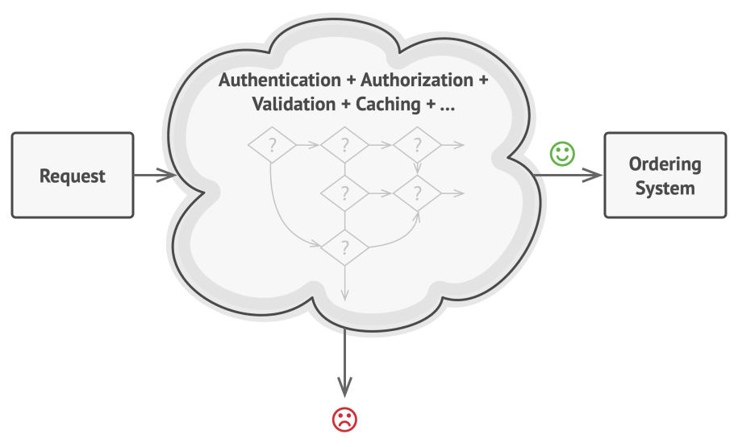
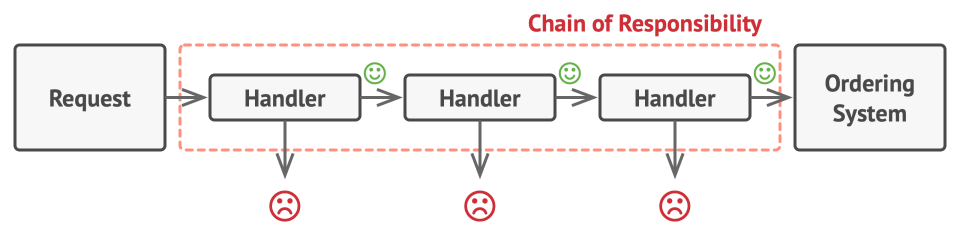
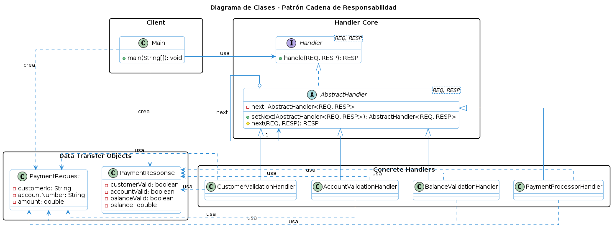

# Patrón Chain of Responsibility
El patrón Chain of Responsibility es un patrón de diseño de software que permite a un objeto enviar una solicitud a una cadena de objetos receptores hasta que uno de ellos maneje la solicitud. Este patrón es útil para desacoplar el emisor de la solicitud del receptor, lo que permite una mayor flexibilidad y escalabilidad en el diseño del sistema.

## Problema
Imagina que estas trabajando en un sistema de procesamiento de solicitudes de pago bancario. 
En el requerimiento se especifica:
- El sistema debe de validar el número de cliente.
- El sistema debe de validar el número de cuenta.
- El sistema debe de validar el saldo disponible.
- Finalmente el sistema debe de procesar el pago.

La forma tradicional de implementar esto sería creando una clase que contenga toda la lógica de validación y procesamiento, lo que puede resultar en un código difícil de mantener y escalar a medida que se agregan nuevas validaciones o tipos de pagos.
Además, si se desea cambiar el orden de las validaciones o agregar nuevas validaciones, se tendría que modificar la clase principal, lo que puede introducir errores y afectar la estabilidad del sistema.

A mi me recuerda a usar if, else if, else para validar cada una de las condiciones, lo que puede resultar en un código difícil de leer y mantener.

Ejemplo referencial:

Fuente: https://refactoring.guru/es/design-patterns/chain-of-responsibility

## Solución
El patrón Chain of Responsibility resuelve este problema al permitir que cada validación sea manejada por un objeto separado, que se encarga de validar una parte específica de la solicitud. Cada objeto en la cadena tiene una referencia al siguiente objeto, lo que permite que la solicitud se pase a través de la cadena hasta que se maneje o se alcance el final de la cadena.

Fuente: https://refactoring.guru/es/design-patterns/chain-of-responsibility

A contiuación se muestra un ejemplo de cómo se podría implementar el patrón Chain of Responsibility para el caso de validación de solicitudes de pago bancario:

